# Provenance as a Service — Architecture Diagrams

Comprehensive Mermaid diagrams for the Hedera hackathon project: proving human creative authority in AI-assisted music production.

---

## 1. Use Case Diagram

Shows all actors and their interactions with the platform.

---

## 2. Solo Artist Sequence Diagram

Full lifecycle of a single artist creating a song with AI assistance, from DID registration through verification.

```mermaid
sequenceDiagram
    actor A as Artist
    participant R as Rails App<br/>(3334)
    participant H as Hedera Service<br/>(3335)
    participant T as Hedera Testnet
    participant M as Mirror Node

    A->>R: Register as Artist
    R->>H: POST /did/register
    H->>T: Create DID Topic
    T-->>H: Topic ID
    H-->>R: did:hedera:testnet:{key}_{topicId}
    R-->>A: Artist DID Created

    A->>R: Create Song Project
    R->>H: POST /songs
    H->>T: Create Song Topic
    T-->>H: Song Topic ID
    H-->>R: Song with HCS Topic
    R-->>A: Song Project Ready

    A->>R: Log Prompt Contribution
    R->>H: POST /contributions
    H->>T: Submit message to Song Topic
    T-->>H: Sequence number
    H-->>R: Contribution logged
    R-->>A: Prompt recorded on-chain

    Note over A: AI generates content<br/>(Suno/Gemini — manual)

    A->>R: Curate & Select Best Take
    R-->>A: Curation saved

    A->>R: Approve Master
    R->>H: POST /credentials
    H->>H: Build W3C VC JSON
    H->>H: SHA-256 hash payload
    H->>H: Sign with Artist key
    H->>H: Sign with Sentinel key
    H->>T: Submit VC to Song Topic
    H->>T: Submit VC to Artist Topic
    T-->>H: Confirmed
    H-->>R: Verifiable Credential
    R-->>A: Provenance VC Issued ✅

    Note over A: Later — distributor verifies

    A->>R: Share VC with Verifier
    R->>H: POST /verify
    H->>M: Resolve Artist DID
    H->>M: Resolve Sentinel DID
    H->>M: Check topic for revocations
    H-->>R: Verification: VALID ✅
    R-->>A: Credential Verified
```

---

## 3. Collaborative Production Sequence Diagram

Two artists working together with ownership splits and dual approval.

```mermaid
sequenceDiagram
    actor P as Producer
    actor V as Vocalist
    participant R as Rails App<br/>(3334)
    participant H as Hedera Service<br/>(3335)
    participant T as Hedera Testnet

    P->>R: Register DID
    R->>H: POST /did/register
    H->>T: Create Producer DID Topic
    H-->>R: Producer DID

    V->>R: Register DID
    R->>H: POST /did/register
    H->>T: Create Vocalist DID Topic
    H-->>R: Vocalist DID

    P->>R: Create Song Project
    R->>H: POST /songs
    H->>T: Create Song Topic
    H-->>R: Song ready

    P->>R: Log beat contribution
    R->>H: Submit to Song Topic
    H->>T: Message: beat (Producer DID)

    V->>R: Log vocal contribution
    R->>H: Submit to Song Topic
    H->>T: Message: vocals (Vocalist DID)

    P->>R: Log arrangement contribution
    R->>H: Submit to Song Topic
    H->>T: Message: arrangement (Producer DID)

    P->>R: Approve master
    V->>R: Approve master

    Note over R: Both approved — issue collaborative VC

    R->>H: POST /credentials
    Note over H: creators:<br/>Producer 60%<br/>Vocalist 40%<br/>Sum = 100% ✅

    H->>H: Build W3C VC with splits
    H->>H: Sign with issuer key
    H->>H: Co-sign with Sentinel key
    H->>T: Submit VC to Song Topic
    H->>T: Submit VC to Producer Topic
    H->>T: Submit VC to Vocalist Topic
    H-->>R: Collaborative VC Issued ✅
    R-->>P: VC with 60/40 split
    R-->>V: VC with 60/40 split
```

---

## 4. Trust Revocation Sequence Diagram

How trust is revoked when a dispute arises, and how verifiers detect it.

```mermaid
sequenceDiagram
    actor A as Artist
    participant R as Rails App<br/>(3334)
    participant H as Hedera Service<br/>(3335)
    participant T as Hedera Testnet
    participant M as Mirror Node
    actor V as Verifier

    Note over A,T: Original VC exists on Song Topic

    A->>R: File dispute / revoke trust
    R->>H: POST /revocations
    H->>H: Build RevocationNotice
    H->>H: Reference original VC hash
    H->>H: Sign with requestor key
    H->>T: Submit RevocationNotice<br/>to Song Topic
    T-->>H: Sequence number
    H-->>R: Revocation recorded
    R-->>A: Trust revoked on-chain

    Note over T: Song Topic now contains:<br/>1. Contributions<br/>2. Original VC<br/>3. RevocationNotice ⚠️

    V->>R: Verify credential
    R->>H: POST /verify
    H->>M: Read all messages on Song Topic
    M-->>H: Messages including RevocationNotice
    H->>H: VC structure valid ✅
    H->>H: Signatures valid ✅
    H->>H: RevocationNotice found ⚠️
    H-->>R: Verification: REVOKED ❌
    R-->>V: Credential has been revoked
```

---

## 5. Sentinel Authority Flow

Why the sentinel co-signing model matters — comparing valid, self-attested, tampered, and missing-sentinel scenarios.

```mermaid
graph TD
    subgraph "Path A: Valid Dual-Signed VC ✅"
        A1[Artist creates contribution] --> A2[Platform validates workflow]
        A2 --> A3[Artist signs VC]
        A3 --> A4[Sentinel co-signs VC]
        A4 --> A5[Submit to HCS]
        A5 --> A6{Verify}
        A6 --> A7[Structure ✅<br/>Artist sig ✅<br/>Sentinel sig ✅<br/>Shares ✅]
        A7 --> A8[VALID ✅]
    end

    subgraph "Path B: Self-Attestation (No Sentinel) ❌"
        B1[Artist creates VC alone] --> B2[Artist signs VC]
        B2 --> B3[No sentinel co-signature]
        B3 --> B4{Verify}
        B4 --> B5[Structure ✅<br/>Artist sig ✅<br/>Sentinel sig ❌]
        B5 --> B6[INVALID ❌<br/>No platform attestation]
    end

    subgraph "Path C: Tampered VC ❌"
        C1[Valid VC issued] --> C2[Attacker modifies splits]
        C2 --> C3[Hash mismatch]
        C3 --> C4{Verify}
        C4 --> C5[Structure ✅<br/>Signatures ❌<br/>Hash mismatch]
        C5 --> C6[INVALID ❌<br/>Tampered payload]
    end

    style A8 fill:#2d6,stroke:#333,color:#fff
    style B6 fill:#d33,stroke:#333,color:#fff
    style C6 fill:#d33,stroke:#333,color:#fff
```

---

## 6. System Architecture Diagram

All components and their connections in the running system.

```mermaid
graph TB
    Browser[🌐 Browser<br/>Artist / Verifier] -->|HTTP| Rails[🛤️ Rails App<br/>Port 3334]
    Rails -->|REST API| Hedera[⚡ Hedera Node Service<br/>Port 3335]
    Hedera -->|gRPC| Testnet[🌐 Hedera Testnet<br/>Create Topics<br/>Submit Messages]
    Hedera -->|REST| Mirror[🪞 Mirror Node<br/>Read Messages<br/>Resolve DIDs]
    Hedera -.->|reads| Sentinel[🔐 .sentinel.json<br/>Platform Identity]

    Browser -.->|browse| HashScan[🔍 HashScan<br/>Public Verification]
    HashScan -.->|reads| Testnet

    subgraph "External AI (Manual Workflow)"
        Suno[🎵 Suno<br/>Music Generation]
        Gemini[🤖 Gemini<br/>Content Generation]
    end

    Browser -.->|manual| Suno
    Browser -.->|manual| Gemini

    subgraph "Data Layer"
        Rails -.->|SQLite| DB[(Database<br/>Artists, Songs,<br/>Contributions)]
    end

    style Testnet fill:#6366f1,stroke:#333,color:#fff
    style Mirror fill:#6366f1,stroke:#333,color:#fff
    style Sentinel fill:#f59e0b,stroke:#333,color:#000
```

---

## 7. Five-Layer Architecture Diagram

The trust stack — each layer builds on the one below it.

```mermaid
graph TB
    subgraph L5["Layer 5: STATE"]
        S1[Provenance Chains]
        S2[Ownership Splits]
        S3[Verification Results]
    end

    subgraph L4["Layer 4: SENTINELS"]
        E1[Platform DID]
        E2[Co-signatures]
        E3[Workflow Validation]
    end

    subgraph L3["Layer 3: ASSERTIONS"]
        C1[W3C Verifiable Credentials]
        C2[Signed Claims]
    end

    subgraph L2["Layer 2: ONTOLOGY"]
        B1["Artists → DIDs"]
        B2["Songs → Topics"]
        B3["Contributions → Messages"]
    end

    subgraph L1["Layer 1: PRIMITIVES"]
        A1[HCS Topics]
        A2[SHA-256 Hashes]
        A3[DID Strings]
    end

    L5 --> L4 --> L3 --> L2 --> L1

    style L1 fill:#1e293b,stroke:#334155,color:#e2e8f0
    style L2 fill:#312e81,stroke:#4338ca,color:#e2e8f0
    style L3 fill:#4c1d95,stroke:#6d28d9,color:#e2e8f0
    style L4 fill:#831843,stroke:#be185d,color:#e2e8f0
    style L5 fill:#7c2d12,stroke:#c2410c,color:#e2e8f0
```

---

## 8. Credential Issuance Data Flow

Detailed view of what happens inside `POST /credentials`.

---

## 9. DID Lifecycle State Diagram

States an artist's DID goes through from creation to potential revocation.

---

## 10. Verification Flow

What happens when a distributor or label verifies a provenance credential.

